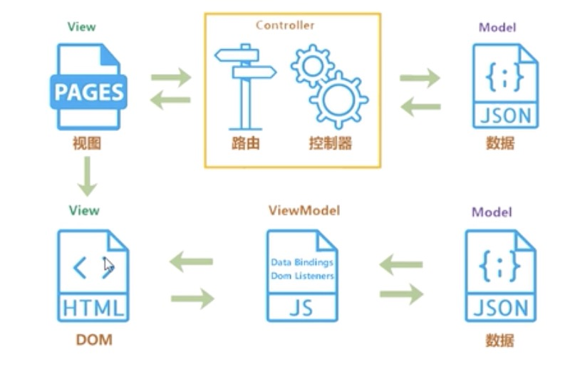

1. 介绍一下 MVVM, 和MVC有什么区别
* 传统的MVC指的是，用户操作请求服务端路由，路由会调用对应的控制器来处理，控制器会获取数据，将结果返回给前端，页面重新渲染。
* MVVM：MVVM不需要用户操作dom元素，将数据绑定到ViewModel层上，会自动将数据渲染到页面中，视图变化会通知ViewModel层更新数据。

MVVM是一个双向绑定的过程。

2. ViewModel有什么好处
  
  把数据和View绑定起来，可以不用去操作dom，只要去关心数据的变化